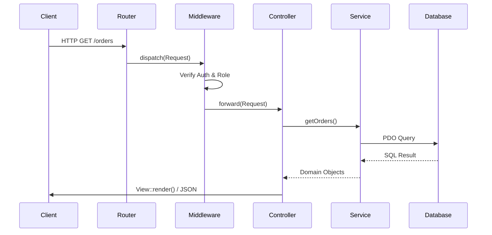
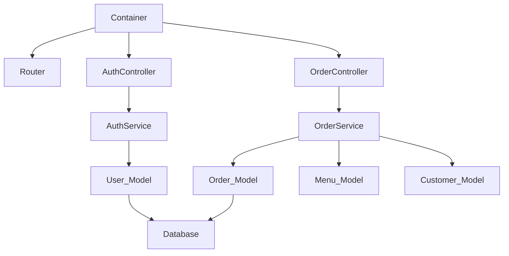

# Architecture

## System Overview

Siwayut Catering is a vanilla PHP 8.2+ MVC micro-framework. It uses no third-party runtime dependencies — Composer is used only for PSR-4 autoloading. The framework provides an IoC container with reflection-based auto-wiring, a router with middleware pipeline, ActiveRecord-style models, and PHP template rendering.

## Request Lifecycle



## Bootstrap Sequence

The exact initialization order in `public/index.php` → `bootstrap/app.php`:

| Step | File | Action |
|------|------|--------|
| 1 | `public/index.php` | `define('BASE_PATH', dirname(__DIR__))` |
| 2 | `public/index.php` | `require vendor/autoload.php` |
| 3 | `public/index.php` | `parse_ini_file('.env')` → `$_ENV` |
| 4 | `public/index.php` | `require config/app.php` → defines `APP_NAME`, `APP_ENV`, `APP_DEBUG`, `APP_URL` |
| 5 | `bootstrap/app.php` | `Logger::setPath(BASE_PATH . '/storage/logs')` |
| 6 | `bootstrap/app.php` | `set_exception_handler(...)` — global error handler |
| 7 | `bootstrap/app.php` | `Session::start()` |
| 8 | `bootstrap/app.php` | `new Container()` |
| 9 | `bootstrap/app.php` | `require config/bindings.php` — register factories |
| 10 | `public/index.php` | Create `Router`, register middleware aliases |
| 11 | `public/index.php` | `require routes/web.php` + `routes/api.php` → register routes |
| 12 | `public/index.php` | `Router::dispatch(new Request())` |

## Dependency Graph

The Dependency Injection Container resolves dependencies automatically.



## Layer Architecture

| Layer | Classes | Responsibility |
|-------|---------|----------------|
| **Controller** | `BaseController`, `AuthController`, `UserController` | Handle HTTP requests, validate input, delegate to services, render views |
| **Service** | `AuthService`, `UserService`, `FileUploadService` | Business logic, password hashing, orchestration |
| **Model** | `BaseModel`, `User` | Database queries via PDO prepared statements |
| **Database** | `Database` (singleton) | PDO connection management |

## Configuration System

| File | Type | Purpose |
|------|------|---------|
| `.env` | INI | Environment variables — loaded via `parse_ini_file()` into `$_ENV` |
| `config/app.php` | PHP (constants) | Defines `APP_NAME`, `APP_ENV`, `APP_DEBUG`, `APP_URL`, sets timezone |
| `config/database.php` | PHP (returns array) | PDO DSN config array with driver, host, port, database, charset, options |
| `config/bindings.php` | PHP (uses `$container`) | Registers factory closures for controllers, services, models |
| `routes/web.php` | PHP (returns closure) | Web routes: public, auth, user, admin |
| `routes/api.php` | PHP (returns closure) | JSON API endpoints |

## Frontend Architecture

Siwayut uses a minimal JavaScript/CSS architecture:
- **Tailwind CSS v4**: Generates utilities without `tailwind.config.js` via `@theme` in `input.css`.
- **Vanilla JS Modules**: Separated files in `public/assets/js/modules/` (e.g. `toast.js`, `modal.js`, `progressive-image.js`).
- **Progressive Images (LQIP)**: Heavy images load a 20px blur thumbnail first to improve Core Web Vitals (LCP).

## Error Propagation

```
throw Exception
       │
       ▼
set_exception_handler()        ← bootstrap/app.php
       │
       ├── Logger::error()     ← log to storage/logs/YYYY-MM-DD.log
       │
       ├── http_response_code()
       │
       ├── APP_DEBUG = true?
       │      YES → HTML dump (class, message, file, line, trace)
       │      NO  → friendly error page:
       │              404 → src/Views/errors/404.php
       │              *   → src/Views/errors/500.php
       │              fallback → inline HTML
       │
       └── exit(1)
```

## Static Facades vs Injected Dependencies

| Pattern | Classes | Usage |
|---------|---------|-------|
| **Static facade** | `Session`, `Logger`, `Csrf`, `Response`, `Database` | Called statically: `Session::get('user')` |
| **Constructor injection** | Services → Controllers, Models → Services | Injected via Container: `new AuthService($userModel)` |

## Component Reference

| Class | File | Documentation |
|-------|------|---------------|
| `Container` | `src/Core/Container.php` | [CONTAINER.md](CONTAINER.md) |
| `Router` | `src/Core/Router.php` | [ROUTING.md](ROUTING.md) |
| `Request` | `src/Core/Request.php` | [ROUTING.md](ROUTING.md) |
| `Response` | `src/Core/Response.php` | [ROUTING.md](ROUTING.md) |
| `View` | `src/Core/View.php` | [VIEWS.md](../frontend/VIEWS.md) |
| `Session` | `src/Core/Session.php` | [MIDDLEWARE.md](MIDDLEWARE.md) |
| `Csrf` | `src/Core/Csrf.php` | [SECURITY.md](../security/SECURITY.md) |
| `Validator` | `src/Core/Validator.php` | [VALIDATION.md](../backend/VALIDATION.md) |
| `Database` | `src/Core/Database.php` | [DATABASE.md](../database/DATABASE.md) |
| `Logger` | `src/Core/Logger.php` | [ARCHITECTURE.md](ARCHITECTURE.md) |
| `BaseModel` | `src/Models/BaseModel.php` | [DATABASE.md](../database/DATABASE.md) |
| `BaseController` | `src/Controllers/BaseController.php` | [ROUTING.md](ROUTING.md) |
| `MiddlewareInterface` | `src/Middleware/MiddlewareInterface.php` | [MIDDLEWARE.md](MIDDLEWARE.md) |
| `AppException` | `src/Exceptions/AppException.php` | [ERROR_HANDLING.md](../security/ERROR_HANDLING.md) |

---

Next: [CONTAINER.md](CONTAINER.md) · [ROUTING.md](ROUTING.md)
