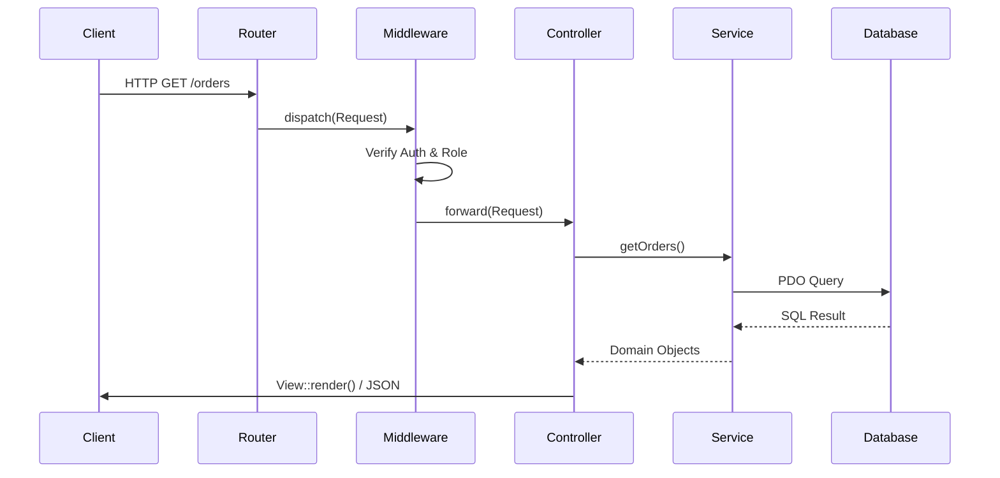
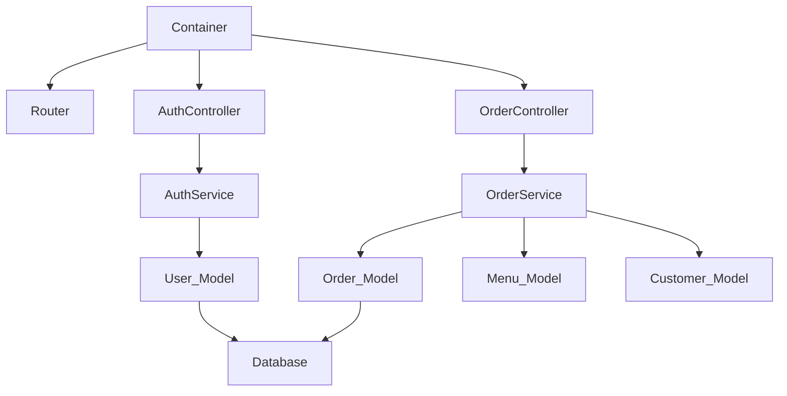

# Arsitektur

## Ringkasan Sistem

Siwayut Catering adalah micro-framework MVC berbasis PHP 8.2+. Framework ini tidak menggunakan dependensi runtime pihak ketiga — Composer hanya digunakan untuk PSR-4 autoloading. Framework ini menyediakan IoC container dengan auto-wiring berbasis refleksi, router dengan pipeline middleware, model bergaya ActiveRecord, dan rendering template PHP.

## Siklus Hidup Request



## Urutan Bootstrap

Urutan inisialisasi yang tepat dalam `public/index.php` → `bootstrap/app.php`:

| Langkah | File | Tindakan |
|------|------|--------|
| 1 | `public/index.php` | `define('BASE_PATH', dirname(__DIR__))` |
| 2 | `public/index.php` | `require vendor/autoload.php` |
| 3 | `public/index.php` | `parse_ini_file('.env')` → `$_ENV` |
| 4 | `public/index.php` | `require config/app.php` → mendefinisikan `APP_NAME`, `APP_ENV`, `APP_DEBUG`, `APP_URL` |
| 5 | `bootstrap/app.php` | `Logger::setPath(BASE_PATH . '/storage/logs')` |
| 6 | `bootstrap/app.php` | `set_exception_handler(...)` — penangan error global |
| 7 | `bootstrap/app.php` | `Session::start()` |
| 8 | `bootstrap/app.php` | `new Container()` |
| 9 | `bootstrap/app.php` | `require config/bindings.php` — mendaftarkan factory |
| 10 | `public/index.php` | Membuat `Router`, mendaftarkan alias middleware |
| 11 | `public/index.php` | `require routes/web.php` + `routes/api.php` → mendaftarkan route |
| 12 | `public/index.php` | `Router::dispatch(new Request())` |

## Grafik Dependensi

Dependency Injection Container menyelesaikan dependensi secara otomatis.



## Arsitektur Layer

| Layer | Kelas | Tanggung Jawab |
|-------|---------|----------------|
| **Controller** | `BaseController`, `AuthController`, `UserController` | Menangani HTTP request, validasi input, delegasi ke service, merender view |
| **Service** | `AuthService`, `UserService`, `FileUploadService` | Logika bisnis, hashing password, orkestrasi |
| **Model** | `BaseModel`, `User` | Query database melalui PDO prepared statements |
| **Database** | `Database` (singleton) | Manajemen koneksi PDO |

## Sistem Konfigurasi

| File | Tipe | Tujuan |
|------|------|---------|
| `.env` | INI | Variabel lingkungan — dimuat melalui `parse_ini_file()` ke dalam `$_ENV` |
| `config/app.php` | PHP (konstanta) | Mendefinisikan `APP_NAME`, `APP_ENV`, `APP_DEBUG`, `APP_URL`, mengatur zona waktu |
| `config/database.php` | PHP (mengembalikan array) | Array konfigurasi PDO DSN dengan driver, host, port, database, charset, opsi |
| `config/bindings.php` | PHP (menggunakan `$container`) | Mendaftarkan closure factory untuk controller, service, model |
| `routes/web.php` | PHP (mengembalikan closure) | Route web: public, auth, user, admin |
| `routes/api.php` | PHP (mengembalikan closure) | Endpoint JSON API |

## Arsitektur Frontend

Siwayut menggunakan arsitektur JavaScript/CSS minimalis:
- **Tailwind CSS v4**: Menghasilkan utility tanpa `tailwind.config.js` melalui `@theme` di `input.css`.
- **Vanilla JS Modules**: File terpisah di `public/assets/js/modules/` (contoh: `toast.js`, `modal.js`, `progressive-image.js`).
- **Progressive Images (LQIP)**: Gambar berukuran besar memuat thumbnail blur 20px terlebih dahulu untuk meningkatkan Core Web Vitals (LCP).

## Propagasi Error

```
throw Exception
       │
       ▼
set_exception_handler()        ← bootstrap/app.php
       │
       ├── Logger::error()     ← log ke storage/logs/YYYY-MM-DD.log
       │
       ├── http_response_code()
       │
       ├── APP_DEBUG = true?
       │      YA → HTML dump (kelas, pesan, file, baris, trace)
       │      TIDAK → halaman error yang ramah:
       │              404 → src/Views/errors/404.php
       │              *   → src/Views/errors/500.php
       │              fallback → inline HTML
       │
       └── exit(1)
```

## Static Facades vs Injected Dependencies

| Pola | Kelas | Penggunaan |
|---------|---------|-------|
| **Static facade** | `Session`, `Logger`, `Csrf`, `Response`, `Database` | Dipanggil secara statis: `Session::get('user')` |
| **Constructor injection** | Service → Controller, Model → Service | Diinjeksi melalui Container: `new AuthService($userModel)` |

## Referensi Komponen

| Kelas | File | Dokumentasi |
|-------|------|---------------|
| `Container` | `src/Core/Container.php` | [CONTAINER.md](CONTAINER.md) |
| `Router` | `src/Core/Router.php` | [ROUTING.md](ROUTING.md) |
| `Request` | `src/Core/Request.php` | [ROUTING.md](ROUTING.md) |
| `Response` | `src/Core/Response.php` | [ROUTING.md](ROUTING.md) |
| `View` | `src/Core/View.php` | [VIEWS.md](../frontend/VIEWS.md) |
| `Session` | `src/Core/Session.php` | [MIDDLEWARE.md](MIDDLEWARE.md) |
| `Csrf` | `src/Core/Csrf.php` | [SECURITY.md](../security/SECURITY.md) |
| `Validator` | `src/Core/Validator.php` | [VALIDATION.md](../backend/VALIDATION.md) |
| `Database` | `src/Core/Database.php` | [DATABASE.md](../database/DATABASE.md) |
| `Logger` | `src/Core/Logger.php` | [ARCHITECTURE.md](ARCHITECTURE.md) |
| `BaseModel` | `src/Models/BaseModel.php` | [DATABASE.md](../database/DATABASE.md) |
| `BaseController` | `src/Controllers/BaseController.php` | [ROUTING.md](ROUTING.md) |
| `MiddlewareInterface` | `src/Middleware/MiddlewareInterface.php` | [MIDDLEWARE.md](MIDDLEWARE.md) |
| `AppException` | `src/Exceptions/AppException.php` | [ERROR_HANDLING.md](../security/ERROR_HANDLING.md) |

---

Selanjutnya: [CONTAINER.md](CONTAINER.md) · [ROUTING.md](ROUTING.md)